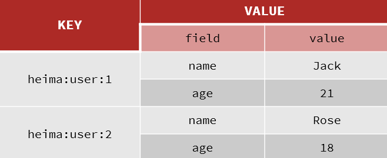
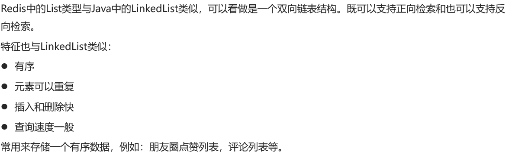

## Data Structures
- #### String
Saved as key-value by byte[], 2 and 3 is allowed to do auto-increment
value: 1. string 2. int 3. float
- **Command**
  - SET: add or update
  - GET
  - MSET: batch add
  - MGET
  - INCR: make an interger key increase 1
  - INCRBY: make an interger key increase specific size(negative allowed)
  - INCRBYFLOAT
  - SETNX: add a string type kv only when it's not exist(also written as: set k v nx)
  - SETEX: add a string type kv and designate expire time


- #### Hash
unordered dictionary, kind of like HashMap in Java

- HSET key field value：添加或者修改hash类型key的field的值
- HGET key field：获取一个hash类型key的field的值
- HMSET：批量添加多个hash类型key的field的值
- HMGET：批量获取多个hash类型key的field的值
- HGETALL：获取一个hash类型的key中的所有的field和value
- HKEYS：获取一个hash类型的key中的所有的field
- HVALS：获取一个hash类型的key中的所有的value
- HINCRBY:让一个hash类型key的字段值自增并指定步长
- HSETNX：添加一个hash类型的key的field值，前提是这个field不存在，否则不执行
- #### List

- LPUSH key element ... ：向列表左侧插入一个或多个元素
- LPOP key：移除并返回列表左侧的第一个元素，没有则返回nil
- RPUSH key element ... ：向列表右侧插入一个或多个元素
- RPOP key：移除并返回列表右侧的第一个元素
- LRANGE key star end：返回一段角标范围内的所有元素
- BLPOP和BRPOP：与LPOP和RPOP类似，只不过在没有元素时等待指定时间，而不是直接返回nil

```
How to simulate stack with List?
Entrance and exit at the same side

How to simulate heap with List?
Entrance and exit at the two side

How to simulate blocking queues with List?
BLPOP and BRPOP
```

- #### Set
It can be seen as a HashMap with no value. Disordered, elements are not repeatable, fast searching, supports intersection, union and other functions
- SADD key member ... ：向set中添加一个或多个元素
- SREM key member ... : 移除set中的指定元素
- SCARD key： 返回set中元素的个数
- SISMEMBER key member：判断一个元素是否存在于set中
- SMEMBERS：获取set中的所有元素
- SINTER key1 key2 ... ：求key1与key2的交集


- #### SortedSet
Kind of like TreeSet in Java, but the underlying implement are different. TreeSet is based on Red-Black Tree while this is based on SkipList and hashtable.
It's ordered(**Sorted**Set), elements unrepeatable, fast searching.(often used to make ranking list)
- ZADD key score member：添加一个或多个元素到sorted set ，如果已经存在则更新其score值
- ZREM key member：删除sorted set中的一个指定元素
- ZSCORE key member : 获取sorted set中的指定元素的score值
- ZRANK key member：获取sorted set 中的指定元素的排名
- ZCARD key：获取sorted set中的元素个数
- ZCOUNT key min max：统计score值在给定范围内的所有元素的个数
- ZINCRBY key increment member：让sorted set中的指定元素自增，步长为指定的increment值
- ZRANGE key min max：按照score排序后，获取指定排名范围内的元素
- ZRANGEBYSCORE key min max：按照score排序后，获取指定score范围内的元素
- ZDIFF、ZINTER、ZUNION：求差集、交集、并集.
PS：所有的排名默认都是升序，如果要降序则在命令的Z后面添加REV即可
